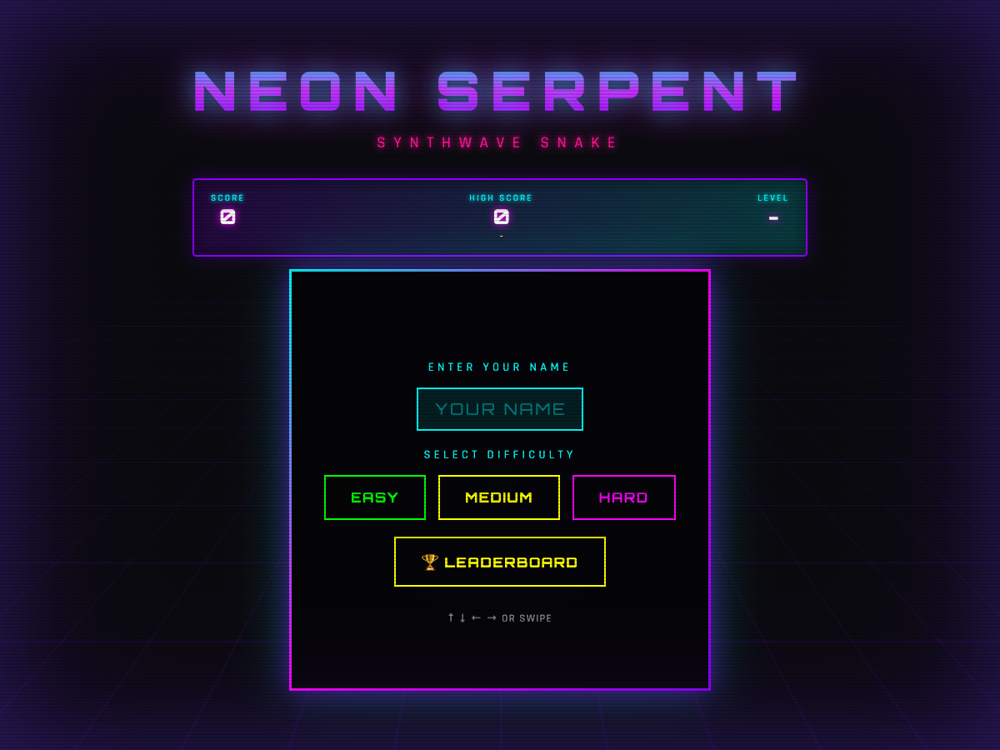
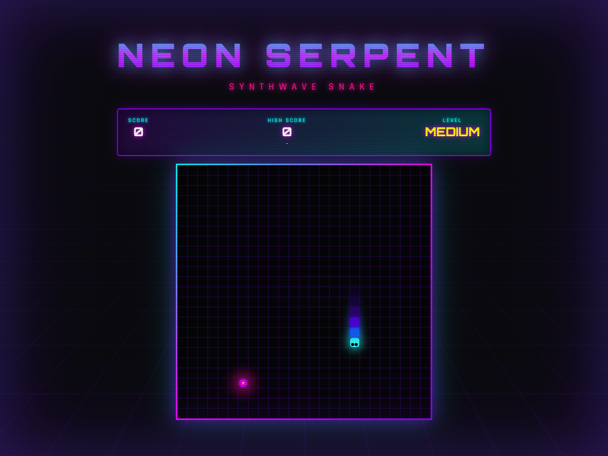

# Neon Serpent

A single-file synthwave Snake game you can play in any modern browser, fork, remix, and host as a static site.

## Screenshots





## Quick start

### Open directly

Download or clone the repo, then open `index.html` in a browser.

### Run a local static server

```bash
npm run serve
```

Then open the local server URL printed by your terminal.

No build step and no install are required.

## What's included

- `index.html` — main playable game file.
- `neon-serpent-standalone.html` — duplicate standalone file for uploads/imports that expect a named single HTML file.
- `assets/` — empty folder for optional remix images/audio.
- `REMIX_GUIDE.md` — practical guide for changing title, colors, speed, scoring, and leaderboard behavior.
- `scripts/verify-html.mjs` — lightweight syntax checker for inline JavaScript.

## Remix knobs

Open `index.html` and search for:

```js
const CONFIG = {
```

That section controls:

- Game title and subtitle
- Theme colors
- Grid size
- Points per food
- Easy, medium, and hard speeds
- Local leaderboard size
- Optional custom leaderboard endpoint

## Leaderboard behavior

Neon Serpent defaults to local-only high scores using `localStorage`, so it works on any static host without a backend.

If you add your own backend later, set:

```js
enableGlobalLeaderboard: true,
apiEndpoint: 'https://your-domain.example/api/scores'
```

Expected API shape:

- `GET` returns `{ "scores": [{ "name": "ACE", "score": 100, "difficulty": "HARD" }] }`
- `POST` receives `{ "name": "ACE", "score": 100, "difficulty": "HARD" }`

## License

MIT. See [`LICENSE`](LICENSE).
